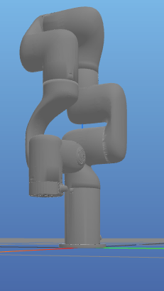

# README_Sim2Real_RL.md

### 注意
現在のPinocchioではURDFを読み込んで、FKとIKをしているが、現在のurdfは実機と異なる。特に、円柱状F/Tセンサが入っていない。また、PinocchioではEEなしのurdfを読み込む必要がある。現在は未対応。

### RealXarm7Demo ロールアウト時のフェーズと関節指令

| ステージ / フェーズ | 遷移条件 (`n` キー含む) | 腕 7 軸＋グリッパ指令の内容 | 参照 |
| --- | --- | --- | --- |
| リセット (`RealXarm7EnvBase._reset_robot`) | `RolloutBase.reset()` 毎に自動。キー操作なし。 | `_set_action` が `init_qpos = [0, -0.5236, 0, 0.7854, 0, 1.3090, 0, 800]` を送るので、ロボットはまずこの姿勢＋グリッパ 800 に移動。 | `robo_manip_baselines/envs/real/xarm7/RealXarm7DemoEnv.py:7-17`, `robo_manip_baselines/envs/real/xarm7/RealXarm7EnvBase.py:143-215` |
| InitialRolloutPhase | `--wait_before_start` が真なら `n` を押すまで継続。 | フェーズ独自のコマンドはなく、`MotionManager.reset()` 直後の値（`ArmConfig.init_arm_joint_pos` と `init_gripper_joint_pos=0`）が送られる。腕は定位置維持、グリッパは 0（開）。 | `robo_manip_baselines/common/base/RolloutBase.py:30-42`, `robo_manip_baselines/common/manager/MotionManager.py:19-35`, `robo_manip_baselines/envs/real/xarm7/RealXarm7EnvBase.py:78-83` |
| GraspPhase (pre-motion) | Initial 終了後に自動開始。0.5 s 経過で遷移。 | `pre_update` が毎ステップ `DataKey.COMMAND_GRIPPER_JOINT_POS=[800]` を書き、腕 7 軸は定位置のまま。結果としてグリッパを 0.5 s かけて閉じ 800 を保持。 | `robo_manip_baselines/envs/operation/OperationRealXarm7Demo.py:7-29`, `robo_manip_baselines/common/base/PhaseBase.py:60-72` |
| RolloutPhase | グリッパ閉動作後に自動開始。`n` で終了（または `auto_exit`/最大時間）。 | `infer_policy()` が観測関節角＋Δコマンドを生成し、アクション空間内にクランプ後、グリッパ成分は `gripper_q_maniskill_to_robomanip` で 0〜840 に変換。これが腕 7 軸＋グリッパに送られる唯一の動的指令。 | `robo_manip_baselines/common/base/RolloutBase.py:45-92`, `robo_manip_baselines/policy/ppo_cus/RolloutPpoCus.py:847-905`, `robo_manip_baselines/common/base/RolloutBase.py:552-565` |
| EndRolloutPhase | `RolloutPhase` 終了後に開始。ログ保存後、再度 `n` を押すと `reset_flag` で次エピソードへ。 | このフェーズで新たな指令は出さず、直前の PPO 指令を維持したまま。環境リセットで再び初期姿勢へ戻る。 | `robo_manip_baselines/common/base/RolloutBase.py:116-138` |

このため、実行時には「定位置への自動移動→`n` (Initial)→グリッパ閉動作→`n` (Rollout 終了)→`n` (End→Reset)」と 3 回の `n` 入力が必要になる。

### メモ（廃案）
- 14 次元の PPO（グリッパ出力なし）を双腕に流すとき、腕成分だけを埋めてグリッパを 0 埋めし、実機側でグリッパ角度を絶対指令で固定する、という一案を検討した。動作は確認したが最終的に採用せず、現在はグリッパ出力も含める設計に戻している。

### RealXarm7DualDemo ロールアウト時のフェーズと関節指令

| ステージ / フェーズ | 遷移条件 (`n` キー含む) | 左右 7 軸＋グリッパ指令の内容 | 参照 |
| --- | --- | --- | --- |
| リセット (`RealXarm7DualEnvBase._reset_robot`) | `RolloutBase.reset()` 毎に自動。キー操作なし。 | `_set_action` が `init_qpos = [0, -0.5236, 0, 0.7854, 0, 1.3090, 0, 119.0, 0, -0.5236, 0, 0.7854, 0, 1.3090, 0, 119.0]` を送り、さらに `_set_action` 内でグリッパ指令を常に `[119.0, 119.0]` に上書きするため、グリッパは一切動かない。 | `robo_manip_baselines/envs/real/xarm7_dual/RealXarm7DualDemoEnv.py:1-21`, `robo_manip_baselines/envs/real/xarm7_dual/RealXarm7DualEnvBase.py:58-103`, `robo_manip_baselines/envs/real/xarm7_dual/RealXarm7DualEnvBase.py:230-325` |
| InitialRolloutPhase | `--wait_before_start` が真なら `n` を押すまで継続。 | 腕は定位置維持。グリッパ値は `_set_action` により毎回 `[119.0, 119.0]` に固定。 | `robo_manip_baselines/common/base/RolloutBase.py:30-42`, `robo_manip_baselines/common/manager/MotionManager.py:19-35` |
| GraspPhase (pre-motion) | Initial 終了後に自動開始し即時終了。キー入力不要。 | `pre_update` をオーバーライドしてグリッパ指令を書かないため、実機グリッパは一切動かない。 | `robo_manip_baselines/envs/operation/OperationRealXarm7DualDemo.py:6-38`, `robo_manip_baselines/common/base/PhaseBase.py:60-72` |
| RolloutPhase | GraspPhase 終了後に自動開始。`n` で終了（または `auto_exit`/最大時間）。 | `infer_policy()` の行動を送るが、グリッパ成分は `_set_action` で毎回 `[119.0, 119.0]` に上書きされる。 | `robo_manip_baselines/common/base/RolloutBase.py:45-92`, `robo_manip_baselines/policy/ppo_cus/RolloutPpoCus.py:847-905`, `robo_manip_baselines/envs/real/xarm7_dual/RealXarm7DualEnvBase.py:230-325` |
| EndRolloutPhase | `RolloutPhase` 終了後に開始。ログ保存後、`n` を押すと `reset_flag` で次エピソードへ。 | 新たな指令は出さず、直前の PPO 指令を維持したまま。環境リセットで再び初期姿勢へ戻る。 | `robo_manip_baselines/common/base/RolloutBase.py:116-138` |

GraspPhase での手動入力をなくしたので、必要な `n` 入力は Single と同様に「開始時 (wait_before_start=True のときのみ)」「Rollout 終了」「End→Reset」。auto_exit=True の場合は EndRolloutPhase も自動で進む（reset_flag 設定まで入力不要）。
