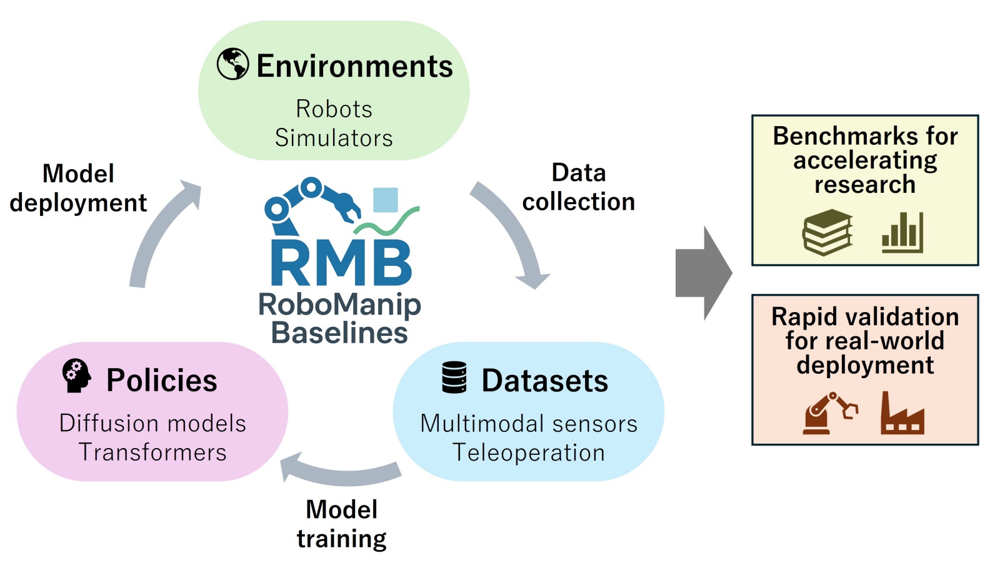
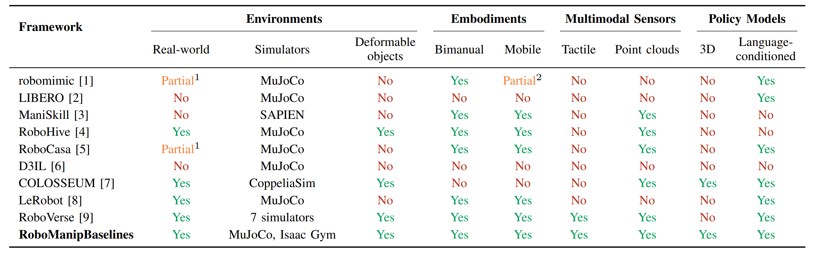
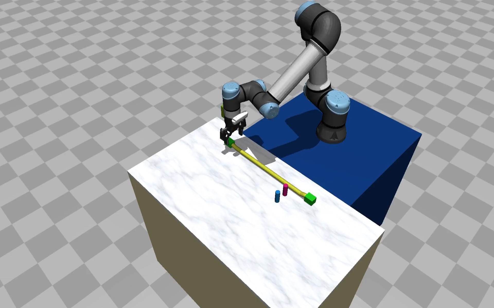
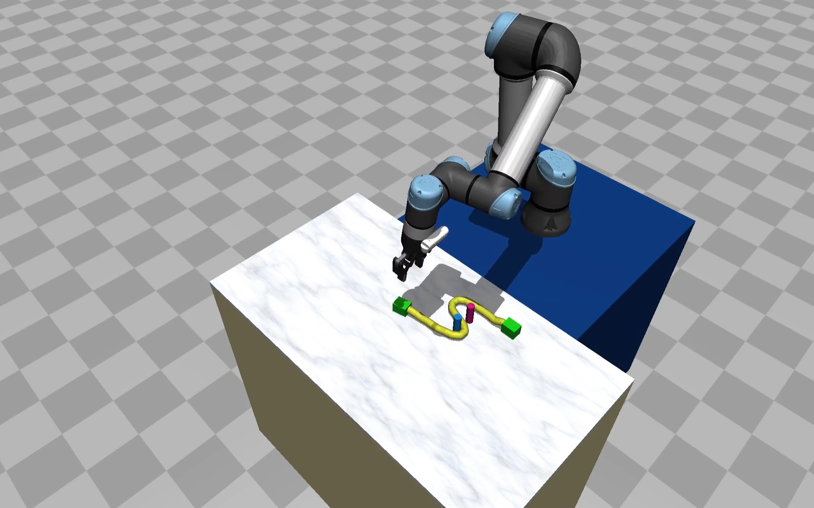

---

# RoboManipBaselines Tutorial for Humanoid Lab Orientation 2026

## 0: git clone and virtual environment setup

Since installation takes time, let's proceed with the tutorial in parallel with the setup waiting time.

1.

```console
$ cd <any directory>
$ git clone https://github.com/isri-aist/RoboManipBaselines.git --recursive
```

2.

```console
Distribute requirement_tutorial.txt to everyone (let’s have them download it from a public GitHub repository). Instead of distributing it, we will paste the link.
```

3.

In parallel, if using ubuntu 22.04:

```conssole
$ sudo apt update
$ sudo apt install python3.10-venv
```

4.

Return to the first terminal:

```console
$ cd RoboManipBaselines
$ python3.10 -m venv .venv
$ pip install -r requirements_tutorial.txt
$ source .venv/bin/activate
$ python --version
```

5.

This takes time:

```console

$ pip install -e .[act]
```

Install ACT from a third party:

```console
$ cd third_party/act/detr
$ pip install -e .
```

---

## 1: What is RoboManipBaselines?

A manipulation platform developed mainly by Masaki Murooka, a researcher at AIST who is also affiliated with JRL.

What you can do (both in simulation and the real world)

* Collection of teleoperation data
* Training of imitation learning policies
* Rollout of imitation learning policies
* Visualization of data
* Rapid comparison and validation of learning algorithms × tasks

[https://isri-aist.github.io/RoboManipBaselines-ProjectPage/](https://isri-aist.github.io/RoboManipBaselines-ProjectPage/)



Comparison with other manipulation learning platforms



---

## 2: Task to confirm the workflow this time

##### MujocoUR5eCable

Initial state


Final successful state


However, it is not necessary to strictly complete the official task. This time, since teleoperation is done with a keyboard and complex operations are difficult, let’s try to train a simple task of just lifting the cable.

---

## 3: Data collection by teleoperation

> [!TIP]
> Instead of collecting data by teleoperation, you can download the public dataset `TeleopMujocoUR5eCable_Dataset30` from [here](https://github.com/isri-aist/RoboManipBaselines/blob/master/doc/dataset_list.md#Demonstrations-in-MuJoCo-environments).

Operate the robot in the simulation and save the data:

```console
#Go to the top directory of this repository
$ cd robo_manip_baselines
$ # Connect a SpaceMouse to your PC
$ python ./bin/Teleop.py MujocoUR5eCable --world_idx_list 0 5 --input_device keyboard
```

if you want to use spacemouse change "keyboard" to "spacemouse"

> [!TIP]
> A teleoperation input device such as a 3D mouse can be used instead of a keyboard. See [here](../robo_manip_baselines/teleop/README.md).

In our experience, models can be trained stably with roughly 30 data sets.
The teleoperation data is saved in the `robo_manip_baselines/dataset/MujocoUR5eCable_<date_suffix>` directory (e.g., `MujocoUR5eCable_20240101_120000`).

---

## 4: Model training

Train the ACT:

```console
# Go to the top directory of this repository
$ cd robo_manip_baselines
$ python ./bin/Train.py Act --dataset_dir ./dataset/MujocoUR5eCable_20240101_120000 --num_epochs 100
```

The default of --num_epochs is 1000, but this time it is made quite short for the tutorial.

The learned parameters are saved in the `robo_manip_baselines/checkpoint/Act/<dataset_name>_Act_<date_suffix>` directory (e.g., `MujocoUR5eCable_20240101_120000_Act_20240101_130000`).

> [!NOTE]
> The following error will occur if the chunk_size is larger than the time series length of the training data.
> In such a case, either set the `--skip` option to a small value, or set the `--chunk_size` option to a small value.
>
> ```console
> RuntimeError: The size of tensor a (70) must match the size of tensor b (102) at non-singleton dimension 0
> ```

The trained parameters are here. If you want to easily use weights trained more thoroughly, download them from here.
[https://github.com/isri-aist/RoboManipBaselines/blob/master/doc/learned_parameters.md](https://github.com/isri-aist/RoboManipBaselines/blob/master/doc/learned_parameters.md)

---

## 5: Policy rollout

Rollout the ACT in the simulation:

```console
# Go to the top directory of this repository
$ cd robo_manip_baselines
$ python ./bin/Rollout.py Act MujocoUR5eCable \
--checkpoint ./checkpoint/Act/MujocoUR5eCable_20240101_120000_Act_20240101_130000/policy_last.ckpt \
--world_idx 0
```

---

## 6: Other imitation learning algorithms and robots that could not be introduced

[https://isri-aist.github.io/RoboManipBaselines-ProjectPage/](https://isri-aist.github.io/RoboManipBaselines-ProjectPage/)

Environments

* MujocoAlohaHandover
* MujocoHsrTidyup
* RealUR5eDualDemo
* RealXarm7Demo

Imitation learning algorithms

* MLP
* SARNN
* ACT
* Diffusion Policy
* 3D Diffusoin Policy
* Flow Policy
* ManiFlow Policy(Image)
* ManiFlow Policy(Pointcloud)
* TACT
* pi0
* GR00T

---

## 7: (If time permits) Teleoperation experience using two 3D mice on a real xArm (planned for about 2–3 people)

#### RealXarm7DualDemo

In this environment, it is possible to operate a dual-arm xArm using two 3D mice.

For reference, only the command is written. To properly execute it in your environment, you need to set up the xArm and configure multiple SpaceMouse devices before running the following command.
[https://github.com/isri-aist/RoboManipBaselines/blob/master/doc/use_multiple_spacemouse.md](https://github.com/isri-aist/RoboManipBaselines/blob/master/doc/use_multiple_spacemouse.md)

```console
$ python ./robo_manip_baselines/bin/Teleop.py RealXarm7DualDemo --config ./robo_manip_baselines/envs/configs/RealXarm7DualDemoEnv.yaml --input_device_config ./robo_manip_baselines/teleop/configs/SpaceMouseDual.yaml
```
